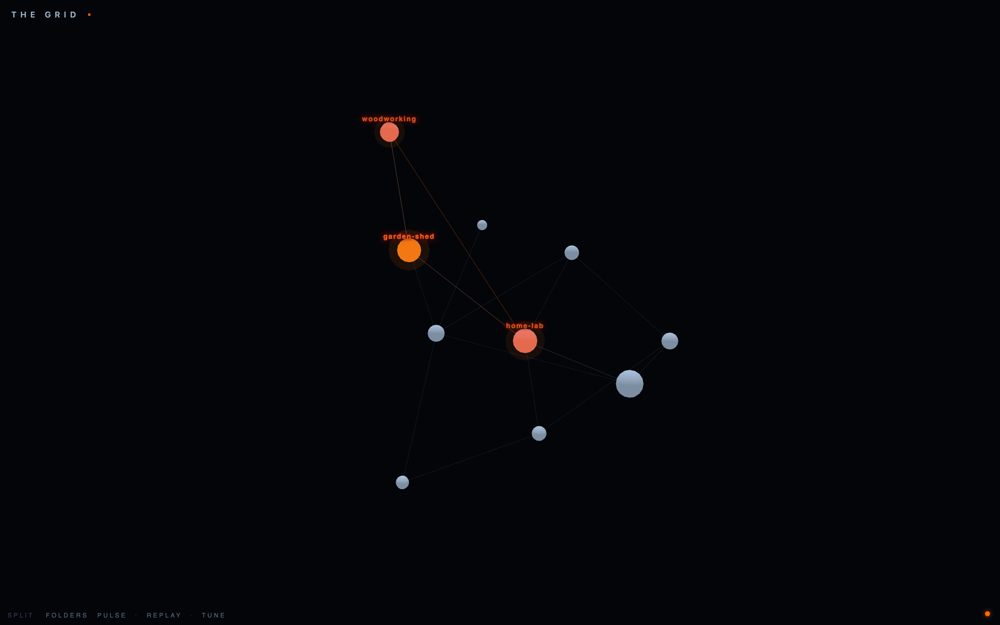

# The Grid

**A live 3D window into an agent working your vault.**

**Optional extra, not a dependency.** The [Trailblaze](../../README.md) second
brain works completely without The Grid. Install this only if you want to watch
the machinery glow.

The Grid renders an Obsidian-style Markdown vault as a galaxy: every note is a
planet (sized by its links and word count), every `[[wikilink]]` is an orbit.
Then it lights up in real time — as a Claude Code agent reads and edits notes in
the vault, those planets flare orange and the route it walks glows as a path of
light. You *watch* the agent think instead of scrolling a log.



## The idea in 30 seconds

Your second brain is a graph, but you normally only see it one file at a time.
The Grid gives it a body. A tiny Claude Code hook writes one line to a local
activity log every time the agent touches a vault file; a small local server
streams that log to a 3D viewer in your browser. Notes flare as they're read,
edits burn a little hotter, and consecutive touches draw a walked trail — the
shape of an agent's attention, live. Nothing but the animation changes; your
vault is never modified by The Grid.

## Install

**Claude Code:**

```
/plugin marketplace add blazemalan/trailblaze
/plugin install trailblaze-grid@trailblaze
```

Then in a Claude Code session, run the setup skill by saying **"set up the
grid"**. It checks prereqs, asks for your vault path, creates the local state
dir and a Python venv, builds the graph, starts the server, and runs a doctor
check. Open **http://127.0.0.1:19333** and get back to work.

## Features

- **Path lighting** — only the notes the agent actually touches light up, and
  only the segments it actually walks glow. The graph stays dark and calm until
  attention moves through it.
- **Replay** — rewatch any past attention run (a "walk", prompt to prompt) with
  a transport bar: play, scrub, and speed control.
- **Splits** — chip toggles reorganize the galaxy into labeled sub-galaxies:
  **FOLDERS** (by top-level folder) or **PULSE** (recently edited vs. dormant).
  Click again to merge back. The sub-galaxies arrange in a 3D ring, so with four
  or more folders some land toward or away from the camera — drag to orbit and
  they separate.
- **TUNE** — an Obsidian-style live settings drawer: glow, node size, link
  visibility, repel force, link distance, and spin, all persisted per device.
- **Click-to-inspect** — click any planet to name it and softly light its direct
  neighbors in blue, so you can trace what connects to what without waiting for
  the agent to walk there.

## Requirements

| Need | Why |
|---|---|
| **macOS or Linux** | the capture hook uses `fcntl` file locking |
| **`python3` ≥ 3.10** with `pip` / `venv` | build script + server (server deps: `fastapi`, `uvicorn`) |
| **An Obsidian-style Markdown vault** | notes = `.md` files, links = `[[wikilinks]]` |
| **Claude Code as your daily driver** | the graph only lights from Claude Code hook events — other editors don't register |
| **A machine that stays on** | "live" means a background server running where you work |

This is an observability toy, not a hosted product: it shows you your own agent,
on your own machine, in real time.

### Where state lives

All mutable state — config, `graph.json`, the activity log, and the venv — lives
under `~/.trailblaze/grid/` (override with the `TRAILBLAZE_GRID_HOME` env var),
never inside the plugin directory. That's deliberate: plugin dirs are read-only
and are garbage-collected when the plugin updates, and the server runs as a
standalone background process where a plugin-scoped data dir wouldn't exist.

## Privacy

The Grid is built to be safe to run on a private vault:

- **All local.** The server binds `127.0.0.1` only and is never configurable to
  anything else. Nothing is sent anywhere.
- **No prompt text is stored.** The hook records *that* you sent a prompt (to
  time the fade animation), never *what* you typed.
- **No content is indexed.** The only text that ever renders is note
  **filenames** — there's no note body, no snippet, no embedding.

Because filenames render, treat the port like any private dashboard: do not
expose it to the public internet. Remote viewing is your own tailnet/VPN's job,
not this plugin's.

## Part of Trailblaze

The Grid ships alongside [Trailblaze](../../README.md), the second-brain plugin
it visualizes. Built by [Blaze Malan](https://github.com/blazemalan). MIT
licensed.
